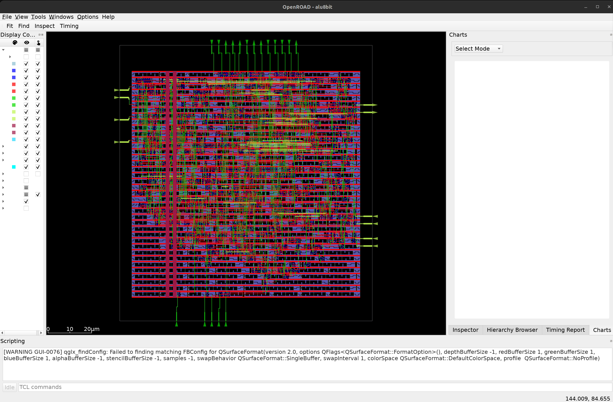

# ALU8BIT-OpenLane-SKY130

An 8-bit combinational ALU taken from Verilog RTL to GDSII using
**OpenLane v2.3.10** on the **SKY130A** PDK (2024.08.17).

## Layout View



Final placed-and-routed layout (KLayout view) — standard cell rows filling
the core, power stripes running vertically, and I/O pins on the top and
bottom edges.

## Design

11 operations (ADD, SUB, MUL, DIV, SHR, SHL, logical/bitwise AND, OR, XOR)
selected by a 4-bit opcode. Inputs: `op_a[7:0]`, `op_b[7:0]`, `inst[3:0]`.
Output: `op_out[7:0]`. Purely combinational — no clock, no internal state.

## Flow

```
RTL -> Synthesis (Yosys) -> Floorplan -> Placement -> Routing (OpenROAD)
    -> STA (OpenSTA, 9 PVT corners) -> DRC (Magic + KLayout) -> LVS (Netgen)
    -> Antenna check -> GDSII
```

```bash
openlane --dockerized config.json
```

## The real work: fixing a timing violation, not just running the tool

The first run passed P&R and DRC/LVS but **failed setup timing** with
WNS = -2.306 ns at the `max_ss_100C_1v60` corner.

- Checked all **9 PVT corners** and found only the 3 SS (slow-slow)
  corners failed — hold and all FF/TT corners were clean.
- Pulled the critical path (`op_b[4] -> op_out[0]`): 33 logic stages.
- Found the root cause in the Yosys log: `op_a / op_b` had synthesized
  into a fully **combinational divider** (`$div`, `$__div_mod_u`) — the
  most expensive arithmetic structure in the design.
- Decided to accept a lower Fmax rather than restructure the divider:
  raised `CLOCK_PERIOD` 20 ns to **25 ns** (~40 MHz), giving ~12% margin.
- Reran the full flow and re-verified against the actual reports —
  all 9 corners now pass.

## Signoff Results

| Metric | Result |
|---|---|
| Clock period | 25.0 ns (~40 MHz) |
| WNS / TNS - Setup & Hold (9 corners) | 0.0 ns |
| DRC (Magic + KLayout) | 0 errors |
| LVS (Netgen) | 0 mismatches |
| Antenna violations | 0 |

## What I actually learned

- Ran a full RTL-to-GDSII ASIC flow with real tools (Yosys, OpenROAD,
  OpenSTA, Magic, KLayout, Netgen) — not a simplified simulation.
- Diagnosed a real setup violation from raw WNS/TNS data across PVT
  corners instead of guessing, and traced it to its root cause by
  correlating the critical path with the synthesis log.
- Learned that a `/` in RTL can silently become the most expensive
  structure a synthesizer produces, and made a justified trade-off
  (accept lower Fmax) instead of a blind fix.
- Learned that a clean-looking layout image proves nothing — only the
  actual WNS/TNS, DRC, and LVS numbers confirm a design is signed off.

## Repository Structure

```
rtl/            RTL source (alu.v)
tb/             Testbench
constraints/    SDC timing constraints
config.json     OpenLane configuration
docs/           Signoff reports
```
